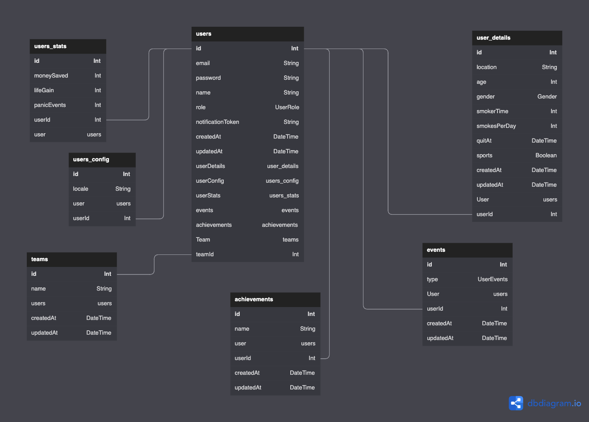

## Install

`npm i` or `yarn`

## Local development

1. Make sure to have a postgres DB instance running locally
2. Run migrations 👉 `npx prisma migrate dev`
3. Run seeds on local DB 👉 `npx prisma db seed`

## DataBase

1. For any changes made on `prisma.schema`, remember to run `npx prisma migrate dev` locally in order to generate new prisma client and update migrations SQL scripts.

## ERD

## Test

- Run all tests once, with coverage results 👉 `npm run test`
- Run all tests while developing with --watch flag 👉 `npm run test:watch`

---

## [API Docs - (swagger)](http://detoxify.ar/api-docs)

## Environments

- DEV 👉 `http://dev.detoxify.ar/api`
- PROD 👉 `http://detoxify.ar/api`

## Endpoints

### Health Check

`GET /health`

---

### Users

All routes need `Authorization` header with a valid bearer token provided to the user making the request.

`GET /users`

`GET /users/:id`

`GET /users/:id/details`

`GET /users/:id/achievements`

`GET /users/:id/snapshot`

`PUT /users/:id`

`POST /users`

### Auth

`POST /auth/login`

`POST /auth/register`

---

TODO:

- Add TLS certificates
- Configure chron job to calculate user stats
